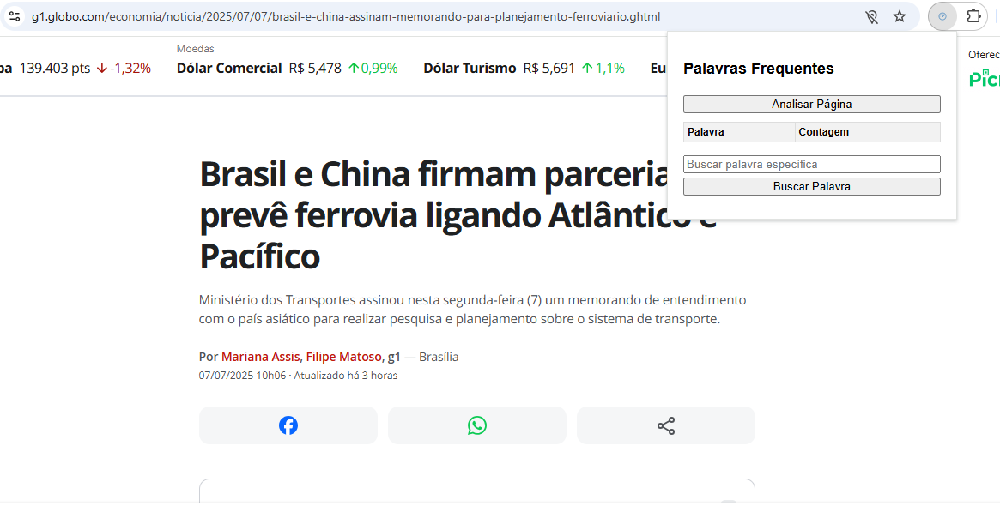

# 🧠 Palavri-metro

Uma extensão do Google Chrome para **analisar as palavras mais frequentes** de qualquer página da web, de forma simples, rápida e intuitiva.

> 🔍 **Descubra quais palavras dominam o conteúdo de uma página!**

---

## 🖼️ Exemplo de uso

Abaixo, uma demonstração da interface da extensão em funcionamento:

> O usuário acessa uma página de notícia, clica na extensão e visualiza a contagem das palavras mais frequentes no conteúdo da página. É possível também buscar por uma palavra específica para saber quantas vezes ela aparece.

---

## 📌 O que é?

**Palavri-metro** é uma extensão que escaneia o texto visível da página atual, elimina palavras comuns (como "de", "o", "e", "para") e mostra uma tabela com as palavras mais utilizadas, ordenadas por frequência.

Além disso, você pode buscar por uma palavra específica e saber quantas vezes ela aparece.

---

## 🧩 Funcionalidades

✅ Analisar palavras mais frequentes  
🔤 Buscar palavra específica  
🧹 Ignora palavras comuns automaticamente (stopwords)  
📊 Mostra o total de palavras diferentes  
📎 Interface leve e fácil de usar  

---